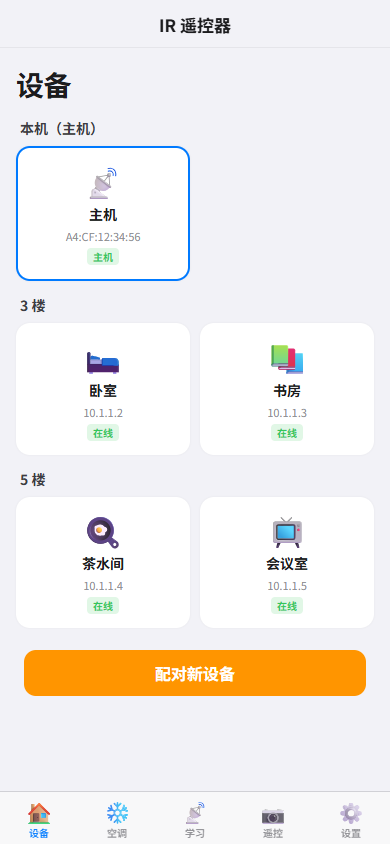
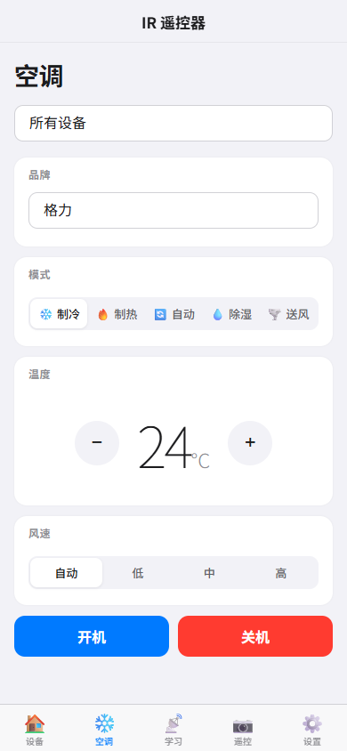

# GK01 AC Controller

基于吉联科技（GreeLink）GK01 开发板的万能红外空调控制器固件。

多台设备自动组网，手机控制一台主机即可同步驱动所有从机发射红外信号。支持设备管理、定向控制、多选发送，适合办公室多楼层场景。

## 功能

- **空调控制** — 内置 30+ 品牌空调协议（格力/华凌/美的/海尔/大金/三菱/松下等），选品牌调温度一键开机
- **设备管理** — 按楼层分组显示所有设备，点击从机卡片可编辑名称、图标、楼层，远程重启或断开
- **多选控制** — 空调页可勾选多个设备一起控制，或全选，或只选部分
- **定向 IR** — 命令可以发给「所有设备」或「指定从机」，互不干扰
- **远程配置** — 主机远程修改从机的 AP 名称/密码，改完从机自动脱钩成为独立主机
- **配对模式** — 主机开启 60 秒配对窗口，新从机加入需要主机确认
- **配对持久化** — 已配对从机的 MAC/名称/图标/楼层保存到 LittleFS，主机重启后自动恢复
- **红外学习** — 捕获任意遥控器信号，命名保存
- **空调状态持久化** — 温度/模式/风速自动保存，重开页面恢复上次设置
- **MQTT Home Assistant** — STA Home 模式接入家庭路由器，支持 HA Climate 自动发现
- **传感器** — DS18B20 温度 + AM312 人体感应（可选配件）
- **OTA 双分区** — rboot 双固件槽，上传写另一分区，启动失败自动回退
- **OTA 防误刷** — WebUI 和固件端双重校验镜像类型、ROM 目标、DOUT flash mode 和文件大小
- **状态 LED** — 上电、AP 就绪、OTA、配对、红外活动都有对应灯光反馈
- **本机按键** — 短按格力制冷 26°C 一键开/关；长按 5 秒恢复出厂
- **恢复出厂** — WebUI 一键恢复，或短路 D7-GND 焊盘 5 秒
- **深色模式** — 跟随系统自动切换，也可手动锁定亮/暗（localStorage 持久化）
- **OTA 实时进度** — WebUI 上传固件时显示实时进度条（XHR upload progress）
- **页面动画** — 页面切换淡入动画、卡片点击缩放反馈
- **iOS 风格界面** — 手机端优化，添加到主屏幕变成独立 App

## 界面预览

### 设备管理



按楼层分组显示所有设备，点击从机卡片可编辑名称、图标、楼层，远程重启或断开。

### 空调控制



多选控制目标（全选/部分/单个），设置自动保存，下次打开恢复上次状态。

## 硬件

| 项目 | 参数 |
|------|------|
| 板子型号 | GK01（IR Mini V105 圆形 PCB） |
| 厂商 | 吉联科技 / GreeLink |
| 主控 | ESP-12F (ESP8266, 80MHz, 4MB Flash) |
| 红外发射 | 8× IR LED（GPIO14/D5） |
| 红外接收 | VS1838B（GPIO5/D1） |
| 指示灯 | 蓝色 GPIO4/D2, 红色 GPIO12/D6, 黄色 GPIO13/D7 |
| 恢复出厂 | 短路 GPIO13/D7 焊盘到 GND 5 秒（与黄色 LED 复用引脚） |
| 温度传感器 | DS18B20（GPIO2/D4，1-Wire，可选） |
| 人体传感器 | AM312 PIR（GPIO16/D0，可选） |
| 供电 | Micro USB（仅供电）或焊盘 VCC/GND |
| 刷写接口 | 焊盘 TX/RX/GND/IO0，需 USB-TTL 转换器 |

## 快速开始

### 1. 编译固件

需要 [PlatformIO](https://platformio.org/)：

```bash
cd firmware
pio run -e rom0 -e rom1
```

日常编译**只需 rom0 + rom1**（rboot 双分区，支持 WebUI OTA）。`factory` / `diag` / `diag_factory` 环境仅用于硬件诊断和救砖，日常使用不需要编译。

PlatformIO 原始产物在 `.pio/build/rom0/firmware.bin`，不要直接拿它做 rboot 首刷或 Web OTA。发布/刷写前先生成 rboot 镜像：

```bash
pio run -e rom0 -e rom1
python prepare_flash.py both
python ..\scripts\make_combined.py
```

也可以从 [GitHub Releases](https://github.com/Timeink88/GK01-AC-Controller/releases) 下载预编译固件。首次刷写优先下载 `combined-vX.X.bin`。

> `factory` 环境只用于硬件诊断、救援和验证主程序能否直接从 `0x0` 启动。`factory` 固件不经过 rboot，也不支持 Web OTA。正式发布和日常使用应刷 `combined.bin`，这样才有 ROM0/ROM1 双分区和 Web OTA。

### 2. 刷写固件

需要 USB-TTL 转换器（如 CH340），连接板子焊盘：

| USB-TTL | 板子焊盘 |
|---------|---------|
| TX | RX |
| RX | TX |
| GND | GND |

**进入刷写模式**：短接 IO0 焊盘和 GND 焊盘，然后上电。

```bash
# 擦除
python -m esptool --port COMx --baud 115200 --before no-reset erase-flash

# 刷写（推荐 combined.bin，一条命令刷完）
python -m esptool --port COMx --baud 115200 --before no-reset write-flash -fm dout 0x0 combined-vX.X.bin
```

> `-fm dout` 是必须的，用 `dio`/`qio` 会失败。板子没有 FLASH 按键，必须短接 IO0-GND 才能进入刷写模式。Micro USB 仅供电，没有数据线。
>
> `firmware-ota-vX.X.bin` 只用于 WebUI OTA 上传，不要用 esptool 写到 `0x0`。`firmware-rom0/rom1-vX.X.bin` 是兼容别名，内容与 `firmware-ota` 相同，不需要手动按 ROM 选择。

刷写完成后必须断开 `IO0-GND`，再重新上电。若仍短接 IO0，ESP8266 会停在下载模式，应用不会启动，也不会出现 WiFi。

### 发布包怎么选

| 文件 | 用途 |
|------|------|
| `combined-vX.X.bin` | 首刷、救砖、从旧版迁移首选；esptool 写到 `0x0` |
| `firmware-ota-vX.X.bin` | WebUI OTA 推荐文件；rboot `EA 04` 应用镜像，内置 `IRACOTA1` manifest + CRC32 |
| `firmware-rom0-vX.X.bin` | 兼容别名；内容与 `firmware-ota` 相同，不需要手动按 ROM 选择 |
| `firmware-rom1-vX.X.bin` | 兼容别名；内容与 `firmware-ota` 相同，不需要手动按 ROM 选择 |
| `rboot-vX.X.bin` | 仅 rboot 引导器；高级分步刷写才用 |

不要把 `firmware-ota` 或 `firmware-rom0/rom1-vX.X.bin` 用 esptool 写到 `0x0`。这些文件不是完整首刷镜像，只能用于 WebUI OTA 或高级分步写入对应 ROM slot。

> 注意：本项目 OTA 包是 slot-independent 设计。WebUI 显示“准备写入 ROM0/ROM1”是为了告诉你设备会写哪个备用分区；真正的写入地址由设备当前运行 ROM 自动决定，当前 ROM0 时写 ROM1，当前 ROM1 时写 ROM0。

### WebUI OTA 升级

已经运行 v2.x rboot 固件的设备，可以在 WebUI「设置 → 固件更新」上传 OTA 包：

| 可以上传 | 不要上传 |
|---------|----------|
| Release 里的 `firmware-ota-vX.X.bin` | `combined-vX.X.bin` |
| 本地 `firmware/flash_images/ota.bin` | `rboot-vX.X.bin` |
| 兼容别名 `firmware-rom0/rom1-vX.X.bin` 或 `flash_images/rom0.bin` / `rom1.bin` | `.pio/build/.../firmware.bin` |
| `prepare_flash.py` 生成的 rboot OTA 应用镜像（`EA 04` + `IRACOTA1` manifest） | 旧版无 manifest 的 OTA 包 |

WebUI 会先读取整个文件并校验镜像：OTA 包必须以 `EA 04` 开头，flash mode 必须是 `DOUT(0x03)`，rboot new image 布局必须正确，内部 ESP8266 checksum 必须匹配，并且 IROM 末尾必须带 `IRACOTA1` manifest。manifest 包含板型 `GK01_IR_MINI_V105`、目标策略、镜像大小和 CRC32。检查不通过时按钮会保持禁用，不会写入 flash。

固件端 `/update` 也会再次校验：上传开始时检查 `EA 04` rboot OTA 头、DOUT 和大小；写入 inactive ROM 后还会从 flash 回读，重新解析 RAM sections、计算内部 checksum、读取 manifest 并计算 CRC32。页面校验只是第一层保护，真正切换 ROM 前固件还会再挡一次。

> OTA 的自动回滚需要新固件至少能启动到应用代码并执行健康检查。如果误传 `combined.bin`、`rboot.bin`、带 eboot 头的 PlatformIO `firmware.bin`、旧版无 manifest 包，或旧版只“剥 eboot”的 `E9` 镜像，设备可能进不了应用代码，软件回滚就没有机会运行。这种情况需要 USB-TTL 进入刷写模式，擦除后重新刷 `combined-vX.X.bin` 到 `0x0`。

OTA 流程固定写入另一个 ROM：当前运行 ROM0 时写 ROM1，当前运行 ROM1 时写 ROM0。这个目标由 rboot 配置和 `/api/ota/status` 动态决定，不需要用户手动指定，也不应该写死文件名。

### 3. 使用

1. 刷写完成后拔插电源重启
2. 手机搜索 WiFi（默认 `IR-AC`），密码 `12345678`
3. 连接后自动弹出控制页面（Captive Portal）
4. 首页默认是「空调」页；「设备」页查看已连接的从机，可改名/设图标/分楼层
5. 「空调」页选择品牌、温度、目标设备，一键控制
6. iOS 用户：Safari → 分享 → 添加到主屏幕

## 多设备协同

### 设备角色

| 角色 | 模式 | 说明 |
|------|------|------|
| 主机 | AP Master | 创建热点、运行 WebUI、广播 IR 命令给从机 |
| 从机 | STA Slave | 连接主机热点、监听 UDP、执行 IR 命令 |
| Home | STA Home | 连接家庭路由器、MQTT 接入 Home Assistant |

### 启动决策

```
上电
  │
  ├─ force_mode = AP → 直接开 AP 主机
  ├─ force_mode = Slave → 只扫描，找不到重试
  ├─ force_mode = Home → 只连路由器，失败重试
  ├─ 没有配置文件（首刷/恢复出厂）→ AP 主机模式
  │
  └─ force_mode = Auto（默认）
       ├─ 有家庭 WiFi 配置 → 尝试连接路由器 → Home 模式
       ├─ 扫描 IR-AC → 找到主机 → 从机模式
       └─ 找不到 → AP 主机模式
```

> 设备默认 SSID 固定为 `IR-AC`。多台设备同场景使用时建议配对后保留主机 BSSID，或通过 WebUI 自定义热点名称来区分。

### UDP 协议

| 消息 | 方向 | 格式 |
|------|------|------|
| HELLO | 从机→主机 | `HELLO:<mac>:<name>:<icon>:<floor>`（每 30 秒心跳） |
| ACK | 主机→从机 | `ACK:`（确认 JOIN/HELLO） |
| HVAC | 主机→从机 | `HVAC:<target>:<vendor>,<power>,<mode>,<temp>,<fan>,<swing>` |
| CONFIG | 主机→从机 | `CONFIG:<id>:<key>=<value>`（远程改从机配置） |
| CONFIGACK | 从机→主机 | `CONFIGACK:<id>:<status>` |
| RAW | 主机→从机 | `RAW:<len>:<data>` |

**HVAC target 格式**：
- `ALL` — 所有从机执行
- `A4CF` — 只有指定从机执行
- `A4CF,B827` — 多个从机执行（逗号分隔）

### 配对流程

1. 手机连主机 → 设备页 → 点「配对新设备」
2. 主机开启 60 秒配对窗口
3. 新从机上电 → 扫描 `IR-AC` → 连接主机
4. 从机发送 HELLO → 主机记录 MAC + 名称 + 图标 + 楼层
5. 60 秒后配对窗口关闭，未配对设备不再被接受

### 从机管理

从「设备」页点击任意从机卡片：
- **改名/图标/楼层** — 通过 CONFIG 协议远程修改，从机存入自己的 LittleFS
- **远程重启** — 发送 `CONFIG:<id>:reboot`
- **断开从机** — 发送 `CONFIG:<id>:disconnect`，从机切换为独立主机

## 网络配置

| 参数 | 默认值 | 说明 |
|------|--------|------|
| WiFi 名称 | `IR-AC` | 可通过 WebUI 修改；多台同场景建议自定义 |
| WiFi 密码 | `12345678` | 可通过 WebUI 修改，至少 8 位 |
| 设备 IP | `10.1.1.1` | AP 模式固定 IP |
| UDP 端口 | `8888` | 主从通信端口 |

> WebUI「设置 → 热点配置」可自定义 SSID 和密码。WebUI「设置 → 设备模式」可强制指定 AP/Slave/Home/Auto 模式。
> Home 强制模式需要先配置家庭 WiFi；未配置时页面会拒绝切换，启动时也会自动回退到 Auto，避免设备失联。

## GPIO 引脚分配

| GPIO | NodeMCU | 功能 | 说明 |
|------|---------|------|------|
| 14 | D5 | IR 发射 | 8× 红外 LED，低电平有效 |
| 5 | D1 | IR 接收 | VS1838B 红外接收器 |
| 4 | D2 | 蓝色 LED | 系统状态指示，低电平点亮 |
| 12 | D6 | 红色 LED | IR 活动指示 |
| 13 | D7 | 黄色 LED | 状态指示；恢复出厂时短路到 GND 5 秒 |
| 2 | D4 | DS18B20 | 1-Wire 温度传感器（可选）；GPIO2 也是启动脚，上电时必须保持高电平 |
| 16 | D0 | AM312 PIR | 人体感应传感器（可选） |
| 0 | IO0 | 刷写模式 | 短接 GND 进入刷写模式 |

### LED 状态

| 状态 | LED 表现 | 含义 |
|------|----------|------|
| 上电进入应用 | 三灯同时亮约 0.3 秒 | 固件已经跑到 `setup()`；若完全不亮，优先检查 IO0 是否仍短接、供电、串口日志和 LED 引脚 |
| 初始化 | 蓝灯短闪 | 文件系统/配置初始化中 |
| 格式化或异常 | 红灯短闪 | LittleFS 挂载失败、连接失败或回退前提示 |
| 扫描/启动 AP | 黄灯亮 | 正在扫描主机或启动 AP |
| AP 主机就绪 | 黄灯常亮 | 手机应能搜索到 `IR-AC` |
| Home/Slave 就绪 | 蓝灯 + 黄灯常亮 | 已连接路由器或主机热点 |
| OTA 待确认 | 红灯快闪 | 新固件运行中，等待稳定运行后确认 |
| 配对窗口 | 红灯慢闪 | 主机正在允许新从机配对 |
| IR 发送/接收 | 红灯短亮 | 红外活动 |
| 短按预设开机 | 蓝灯闪两下 | 已发送格力制冷 26°C 开机 |
| 短按预设关机 | 黄灯闪两下 | 已发送格力关机 |

### 本机按键

GPIO13/D7 与黄色 LED 复用，可作为本机按键/触点使用：

| 操作 | 功能 |
|------|------|
| 短按 | 格力制冷 26°C 一键开/关；AP 主机会广播给所有已配对从机 |
| 长按 5 秒 | 恢复出厂设置，清除 WiFi/MQTT/热点/从机配对/OTA 状态 |

## 页面说明

| 页面 | 功能 |
|------|------|
| 空调 | 品牌/温度/模式/风速控制，多选目标设备 |
| 遥控 | 发送已保存的信号，支持编辑/删除 |
| 设备 | 设备拓扑/楼层分组，从机管理（命名/图标/楼层/远程配置） |
| 学习 | 捕获遥控器信号，命名保存 |
| 设置 | 网络/MQTT/热点/设备模式，OTA 更新，恢复出厂 |

## 空调品牌

内置支持 30+ 空调协议。以下品牌使用自研编码器：

| 品牌 | 协议名 | 说明 |
|------|--------|------|
| 华凌 | `WAHIN` | R05D 协议，Gray 码温度编码 |
| 格力 | `GREE` | YBOFB 遥控器，双帧 A+B |

其余品牌（美的/海尔/大金/三菱/松下等）通过 [IRremoteESP8266](https://github.com/crankyoldgit/IRremoteESP8266) 库支持。

> 内置品牌无法控制时，使用「学习」功能捕获遥控器原始信号。

## API

| 接口 | 方法 | 说明 |
|------|------|------|
| `/` | GET | WebUI 页面 |
| `/api/hvac` | POST | 空调控制（支持 `target` 参数多选） |
| `/api/hvac/state` | GET | 获取上次空调设置（vendor/mode/temp/fan） |
| `/api/send` | POST | 发送原始红外信号 |
| `/api/capture` | GET | 获取最近捕获信号 |
| `/api/wifi/scan` | GET | 扫描 WiFi 网络 |
| `/api/wifi/connect` | POST | 连接 WiFi 并重启 |
| `/api/wifi/status` | GET | 当前网络状态 |
| `/api/wifi/forget` | POST | 清除 WiFi 配置并重启 |
| `/api/ap/config` | GET/POST | 读取/保存 AP 热点配置 |
| `/api/mqtt/config` | GET/POST | 读取/保存 MQTT 配置 |
| `/api/mode/force` | POST | 强制设备模式（auto/ap/slave/home） |
| `/api/device/config` | GET/POST | 本机设备名称/图标/楼层 |
| `/api/slaves` | GET | 已连接从机列表（含名称/图标/楼层） |
| `/api/slave/config` | POST | 远程配置指定从机（name/icon/floor/ap_ssid/reboot/disconnect） |
| `/api/pair/start` | POST | 开启 60 秒配对窗口 |
| `/api/pair/stop` | POST | 关闭配对窗口 |
| `/api/system/info` | GET | 设备信息（MAC/ChipID/模式/运行时间） |
| `/api/factory/reset` | POST | 恢复出厂设置 |
| `/api/sensor` | GET | 温度和人体传感器状态 |
| `/api/ota/status` | GET | 当前 ROM 分区状态 |
| `/update` | POST | OTA 固件上传 |

## 项目结构

v3.0 起按领域模块化拆分，单文件 `main.cpp` 拆成 28 个文件：

```
├── firmware/
│   ├── platformio.ini               # PlatformIO 配置（rboot 双分区 OTA）
│   ├── src/
│   │   ├── main.cpp                 # 入口：setup()/loop() 框架（~90 行）
│   │   ├── app/
│   │   │   ├── app_context.{h,cpp}  # AppContext：聚合所有子系统 + decideBootMode
│   │   │   └── mode_factory.{h,cpp} # DeviceMode 工厂
│   │   ├── core/
│   │   │   ├── pins.h               # GPIO 引脚集中定义
│   │   │   ├── constants.h          # 间隔/超时/容量等魔数集中
│   │   │   ├── json_builder.{h,cpp} # 栈分配 JSON 构造器（零 heap）
│   │   │   └── string_utils.{h,cpp} # sanitize/parse/jsonEscape 工具
│   │   ├── config/
│   │   │   └── config_store.{h,cpp} # Config 结构 + LittleFS 持久化 + 延迟批写
│   │   ├── hw/
│   │   │   ├── led_manager.{h,cpp}  # 三色 LED 状态机
│   │   │   ├── button_manager.{h,cpp} # GPIO13 复用按键（短按/长按）
│   │   │   ├── sensor_service.{h,cpp} # DS18B20 + AM312
│   │   │   ├── ir_service.{h,cpp}   # IR 收发互斥 + 固定缓冲捕获
│   │   │   └── hvac/
│   │   │       ├── hvac_encoder.h    # IEncoder 接口
│   │   │       ├── hvac_registry.{h,cpp} # vendor → encoder 注册表
│   │   │       ├── wahin_encoder.{h,cpp} # 华凌 R05D（Gray 码温度）
│   │   │       ├── gree_encoder.{h,cpp}  # 格力 YBOFB（双帧 A+B）
│   │   │       └── irac_encoder.{h,cpp}  # 通用 IRremoteESP8266 适配
│   │   ├── net/
│   │   │   ├── network_manager.{h,cpp} # WiFi STA/AP/重连统一
│   │   │   ├── mqtt_service.{h,cpp}    # PubSubClient + HA discovery
│   │   │   └── udp_mesh.{h,cpp}        # 主从 UDP 协议
│   │   ├── web/
│   │   │   ├── web_server.{h,cpp}      # 路由 + Captive Portal + 流式响应
│   │   │   └── api/web_api.{h,cpp}     # 20+ API handlers
│   │   ├── ota/ota_manager.{h,cpp}     # rboot + manifest + CRC32 + 回滚
│   │   ├── modes/                      # DeviceMode 策略子类
│   │   │   ├── device_mode.h           # 抽象基类
│   │   │   ├── ap_master_mode.{h,cpp}
│   │   │   ├── sta_slave_mode.{h,cpp}
│   │   │   └── sta_home_mode.{h,cpp}
│   │   ├── diag.cpp                   # 独立硬件诊断固件（factory 环境）
│   │   └── rboot-api.cpp              # rboot SDK 桥接
│   ├── include/webui.h                # iOS 风格 WebUI（PROGMEM 内嵌，5 Tab）
│   ├── legacy/main_v1.cpp             # v2.x 单文件参考（不参与编译）
│   ├── prepare_flash.py               # 生成 EA04 + IRACOTA1 OTA 包和首刷 combined 镜像
│   ├── rboot-bootloader/              # rboot 双分区引导器（MIT）
│   └── ld/                            # rboot 链接脚本（ROM0/ROM1）
├── scripts/
│   └── make_combined.py               # 合并 rboot + ROM0 生成单文件刷写镜像
├── screenshots/                       # WebUI 界面截图
├── .github/workflows/
│   ├── ci.yml                         # push 自动编译验证
│   └── release.yml                    # tag 自动编译 + 发 GitHub Release
└── README.md
```

### 架构要点

- **DeviceMode 策略模式**：`ApMasterMode` / `StaSlaveMode` / `StaHomeMode` 继承 `DeviceMode` 基类，消除散布的 `if (deviceMode == ...)` 分支，新增模式只需加一个子类
- **HvacEncoder 注册表**：`GREE` / `WAHIN` 走自研编码器，其他品牌走 `IRremoteESP8266` 通用路径；新增品牌只需实现 `IEncoder` 接口并注册一行
- **AppContext 协调**：聚合所有子系统（config/leds/sensors/ir/hvac/network/mqtt/udp/web/ota），消除 141 个 free-floating 全局变量
- **向后兼容**：API 路由、UDP 协议、MQTT topic、LittleFS 配置文件格式、OTA manifest 完全保持，旧固件升级不需要擦除配置

## 技术栈

- **框架**：Arduino (ESP8266, espressif8266@4.2.1)
- **IR 库**：[IRremoteESP8266](https://github.com/crankyoldgit/IRremoteESP8266) v2.8.6+
- **MQTT**：[PubSubClient](https://github.com/knolleary/pubsubclient)（Home Assistant 集成）
- **传感器**：DallasTemperature + OneWire（DS18B20）
- **Web 服务器**：ESP8266WebServer
- **DNS**：DNSServer（Captive Portal）
- **设备通信**：WiFi UDP（HELLO/ACK/CONFIG/HVAC/RAW 协议）
- **OTA**：rboot 双分区 + 自定义 Web 上传/镜像校验/自动回滚
- **存储**：LittleFS（配置 + OTA 状态）
- **前端**：原生 HTML/CSS/JS，无框架

## CI/CD

推送到 `master`/`dav` 时 GitHub Actions 自动编译验证。打 `v*` tag 时自动编译固件文件、校验 OTA manifest/CRC，并发 GitHub Release：

| 文件 | 用途 |
|------|------|
| `combined-vX.X.bin` | 首刷/救砖首选：rboot + ROM0，esptool 写到 `0x0` |
| `firmware-ota-vX.X.bin` | WebUI OTA 推荐文件；rboot `EA 04` 应用镜像，内置 `IRACOTA1` manifest + CRC32 |
| `firmware-rom0-vX.X.bin` | 兼容别名；内容与 `firmware-ota` 相同 |
| `firmware-rom1-vX.X.bin` | 兼容别名；内容与 `firmware-ota` 相同 |
| `rboot-vX.X.bin` | 仅 rboot 引导器；分步刷写时写到 `0x0000` |

## 版本历史

| 版本 | 说明 |
|------|------|
| v1.3 | 初始版本，基础空调控制 + 学习 + 协同 |
| v1.4 | 网络配置宏化、AP 自动选频、按键触发 IR、灯光 bug 修复 |
| v1.5 | 华凌空调自定义编码器（R05D/Gray码）、格力 YBOFB 自定义编码器、Captive Portal |
| v2.0 | WiFi STA + MQTT Home Assistant + DS18B20 温度 + AM312 人体传感器 + rboot 双分区 OTA |
| v2.2 | AP 热点名称/密码可配置、从机自适应组网、短路 D7-GND 恢复出厂、WebUI 恢复出厂设置 |
| v2.3 | AP 热点配置、强制模式切换、从机列表+配对模式、WebUI 显示 MAC |
| v2.4 | 设备管理（楼层分组/命名/图标）、多选控制、定向 IR、远程配置从机、空调状态持久化、深色模式、rboot `EA 04` OTA 镜像、`IRACOTA1` manifest + CRC32 防误刷、LED 状态反馈、短按办公室预设 |
| v3.0 | 架构重写：3001 行单文件拆分为 28 个模块化文件（按领域分层 app/core/config/hw/net/web/ota/modes）；DeviceMode 策略模式替代 if 分支；HvacEncoder 注册表替代 vendor if 链；HvacState 单一状态源；UI 升级（OTA 实时进度条/手动暗色模式/页面切换动画）；体积 600KB → 584KB；行为 100% 向后兼容 |

## 许可证

MIT
